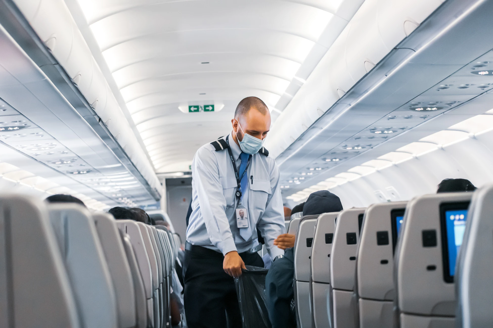
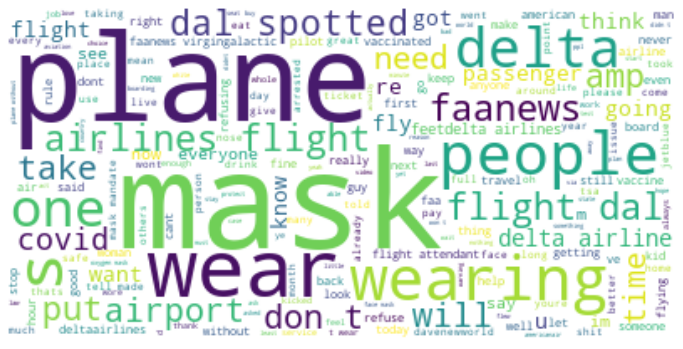
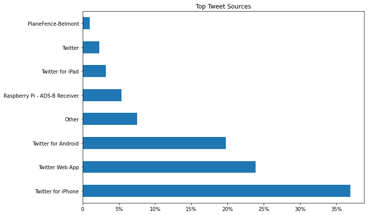
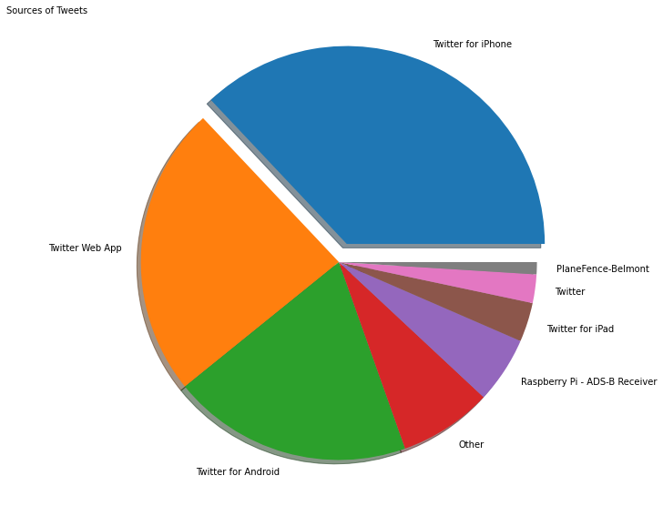
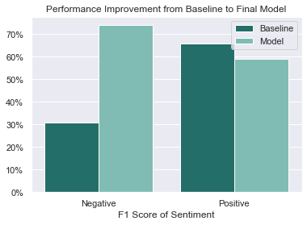

# **Mask Mandate Sentiment Analysis Using NLP**
## An NLP exploration of Twitter sentiment about mask mandates while traveling on airlines



Author: **Jax Garnett**


## Table of Contents
* [Overview](#overview)
* [Business Understanding](#business-understanding)
* [Data Understanding and Preparation](#data-understanding-and-preparation)
* [Model Training and Testing](#model-training-and-testing)
* [Recommendations and Conclusion](#recommendations-and-Conclusion)
* [Author](#author)
* [Project Structure](#project-structure)


## Repository Links
* [Data](/data)
* [API Request Code](/tools)
* [Images](/images)


## Overview

For this project, I built a ------ model after going through robust natural language preprocessing steps that is used to predict tweet sentiment using the text of the tweet. We used data gathered from the Twitter API recently published on Twitter within the last two weeks. The resulting dataset consisted of over five thousand tweets containing keywords like mask mandate, Delta Airlines or FAANews. We were able to address The Federal Aviation, further refered to as the FAA's business problem and how to solve it with the help of machine learning. We designed a workflow that enabled us to quickly make accurate sentiment predictions for a given tweet and later used to iterate through more fresh data in order for us to gather conclusive and holistic insights into how to repond to the tweets. This project demonstrates our ability to perform data discovery, engineering and analysis. I created insightful visualizations with Matplotlib, and used libraraies such as Pandas, Sklearn, NLTK and Imblearn. Finally a non-technical presentation to showcase my understanding of key machine learning strategies in simple terms that were used to complete this project.


## Business Understanding

We framed our business problem by taking the role of an independent social media management agency. Our client is looking to find a way to identify and classify inflammatory tweets potentially spreading misinformation regarding the FAA's mask mandate. Delta has initiated a pilot program in partnership with the FAA to address public sentiment around mask mandates, passenger safety and conduct. This pilot is initially scoped to their largest engagement resource, Twitter. This year the FAA has had an unprecedented uptick in reports of unruly passengers and of 19 August 2021, 74% of all unruly passenger incidents on planes were attributed to issues around the federal mask mandate. The mindsets and behaviors that lead to unruly passengers begin long before they board a plane or even enter an airport, it begins in the everyday lives of people all across the US and globe. Delta desires to meet them where they are having these conversations, which is largely on social media. The client has established that they are not looking to dispel hoaxes but rather simply respond to. 



My task is to identify the most inflammatory tweets which we believe responding to will have the greatest impact. i.e. That masks on planes are ineffective. The communications teams do not have the manpower to effectively track, identify, and then craft responses to negative sentiment due to the overwhelming volume. We are using my data to accurately predict tweet sentiment, find the most inflammatory ones, using Multinomial Naive Bayes modeling, and then prompt the FAA with recommended responses. That way our communications specialists can focus on reviewing and editing responses, rather than scouring feeds hoping to come across the ones they need to address. 

## Data Understanding and Preparation

The data aggregated from the Twitter API, using the Postman endpoint, consisted  of over five thousand tweets containing keywords like mask mandate, Delta Airlines or FAANews. The data is located within the ‘data/tweets.csv’ file in this repository. In total, there are 14,723 rows of data and  columns. Of these 272 columns, 7 of the columns are described below. The first  columns are records of the given Zip code’s average home value between April, 1996 and April, 2018. The other 7 columns are:


* ‘ID’- Each record contained a unique ID number. This column deemed unimportant for our analysis.
* ’Text’-This is the column that provides the tweet text.
* ’Geo’- If provided the place id of the city in which the tweet was published.
* ’Possibly Sensitive’- If the tweet contained sensitive information. This column was determined to be irrelevant/misleading and didn't contribute to my analysis.
* ’Source’- The device type that the tweet was made with.
* ’Created_At’- Exact time the tweet was published.




Our project goal was defined by our Business Problem where our client was only interested in identifying and understanding particularly negative tweets. Therefore, the metric most important to us getting accurate was true negatives, or correctly identifying negative tweets.


Traditional data cleaning consisted of checking for null values. Geo proved not very useful since only 12 tweets contained place ids so that was dropped. We also renamed the columns to be more simple. The dataset had four target classes, “Positive, Negative, Neutral, Unsure”. We removed “Unsure” and cut it down to three targets. Finally, we label encoded the three target classes.

Text preprocessing is important for NLP tasks. Transforming text from raw sentences and phrases, into a form that the model can extract information from, consists of many steps and actions. The Preprocessing Steps taken are as follows:

Removing Twitter specific embedded text like mentions, Retweets, Links, Videos, and Hashtags Tokenizing, which is turning strings into a list of words Lower casing all letters in the dataset Removing stop words that do not add meaning to a sentence. Words “like the, and, at” Removing punctuation and symbols Stemming words to their root




## Model Training and Testing


<ins> **Testing our Model Performance** </ins>

We first created our baseline model with a dummy classifier. Due to the large target class imbalance, we set the dummy to use the stratified strategy. We wanted to use a tfidf vectorizer, and a multinomial naive bayes classifier. We created a pipeline using those two models and added a smote for our target class imbalance. I then ran a grid search on that pipeline to find our best parameters. The hyperparameter tuning was used to maximize precision scores of the model to have the least false positives as positives as possible. Once the best parameters were identified, I entered them into a pipeline. From there I was able to keep the parameters constant while focusing solely on an individual parameter and adjusting it to maximise my precision. This method saved time by affording us the ability to bypass conducting a new grid search with every experimentation we ran on the parameter tuning at the micro-level. Once it was determined that we had the best hyper-parameter, the process was repeated on all applicable parameter settings.


## Recommendations and Conclusion





In conclusion after an iterative process and hyper-parameter tuning then trying a few different kinds of models, Multinomial Bayes still came on top. Our best performing model, was able to classify the negative tweets with 75% accuracy.


## Author
- Jax Garnett<br>
    Github: https://github.com/pleasecallmejax<br>
    Email: jax.chaise@gmail.com<br>

## Project Structure
```
├── final_notebook.ipynb
├── README.md
├── presentation_slides.pdf
├── data
├── images
└── tools
    ├── __init__.py
    └── helpers.py
```
